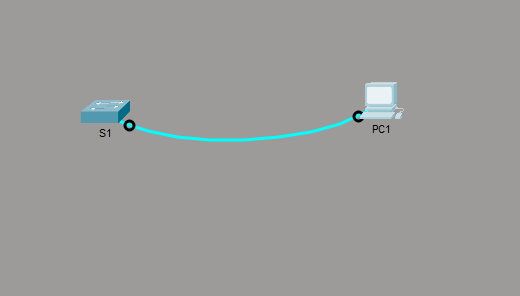

# Cisco Packet Tracer

## Aufgabe 1 - Navigate the IOS

### Part 1

Verbindung zwischen Switch und PC

#### Serial Connection

Wichtig bei der Serial Verbindung ist, dass die Baud Rate auf beiden Geräten gleich ist.

### Part 2

#### Befehle anzeigen

Mit ´´´?´´´ werden alle Befehle angezeigt.

Mit ´´´r?´´´ können alle Befehle welche mit "r" beginnen angezeigt werden.

#### priveleged EXEC mode öffnen

´´´ cisco
enable
´´´

#### Global Configuration mode

Hiermit kann man den Global Configuration mode öffnen

´´´ cisco
configure
´´´

### Part 3

Hier sieht man wie ich mit ´´´clock´´´ die Uhrzeit und das Datum geändert habe.

## Aufgabe 2 - Configure Initial Switch Settings

