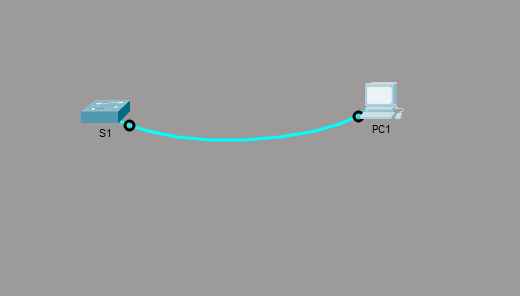
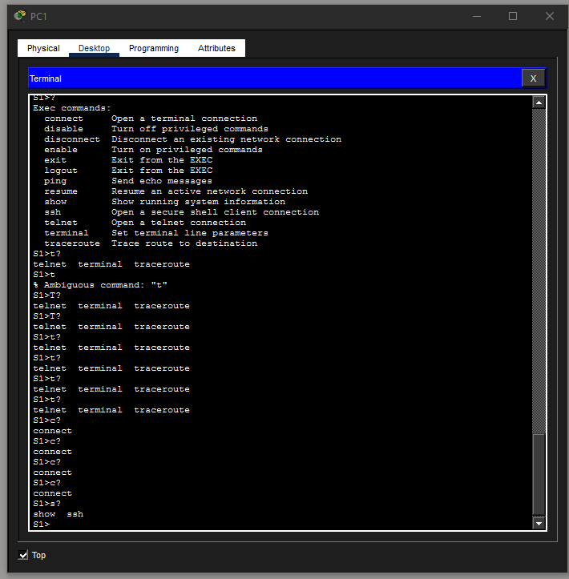
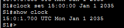

# Cisco Packet Tracer

## Aufgabe 1 - Navigate the IOS

### Part 1

Verbindung zwischen Switch und PC



#### Serial Connection

Wichtig bei der Serial Verbindung ist, dass die Baud Rate auf beiden Geräten gleich ist.



### Part 2

#### Befehle anzeigen

Mit `?` werden alle Befehle angezeigt.

Mit `r?` können alle Befehle welche mit "r" beginnen angezeigt werden.

#### priveleged EXEC mode öffnen

``` cisco
enable
```

#### Global Configuration mode

Hiermit kann man den Global Configuration mode öffnen

``` cisco
configure
```

### Part 3

Hier sieht man wie ich mit `clock` die Uhrzeit und das Datum geändert habe.



## Aufgabe 2 - Configure Initial Switch Settings

### Switch config

Hier sieht man meine Switch Config mit `sh run`

### Passwörter wechseln

**Wichtig** Passwöter werden im Klartext gespeichert

#### Console Passwort

``` cisco
line console 0
```

``` cisco
password letmein
```

``` cisco
login
```

#### Enable Passwort

``` cisco
enable password c1$c0
```

#### Veschlüsseltes Passwort

``` cisco
enable secret itsasecret
```

Passwort im Klartext nachträglich verschlüsseln

``` cisco
service password-encryption
```

### MOTD Banner erstellen

``` cisco
banner motd "This is a secure system. Authorized Access Only!"
```

### Config speichern in nvram

Mit diesem Befehl in NVRAM speichern dass es nach dem neustarten nicht zurückgesetzt wird.

``` cisco
copy running-config startup-config
```

Kann aber auch mit dem veralteten Befehlt gemacht werden.

``` cisco
write
```

oder

``` cisco
wr
```
