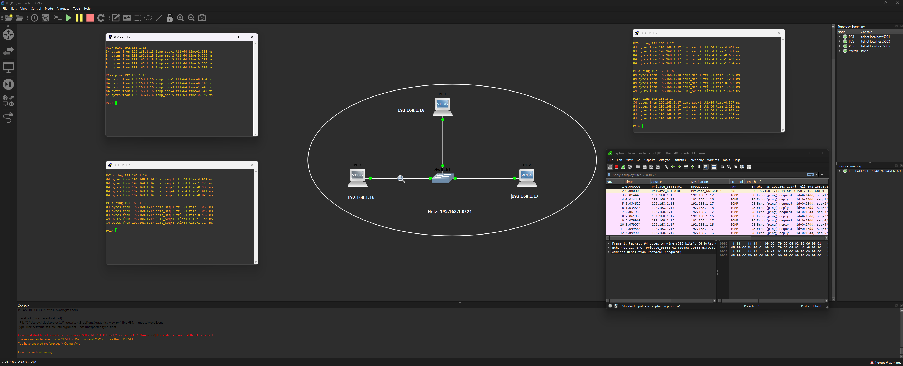
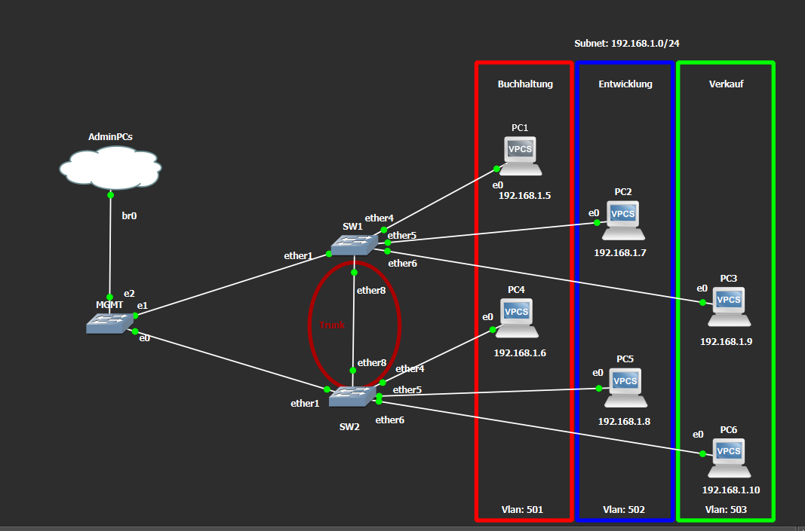
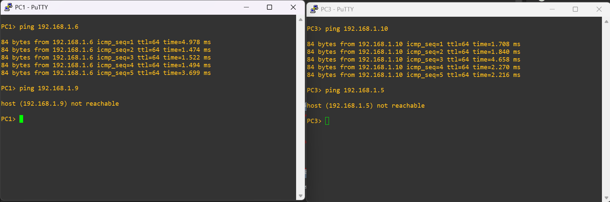
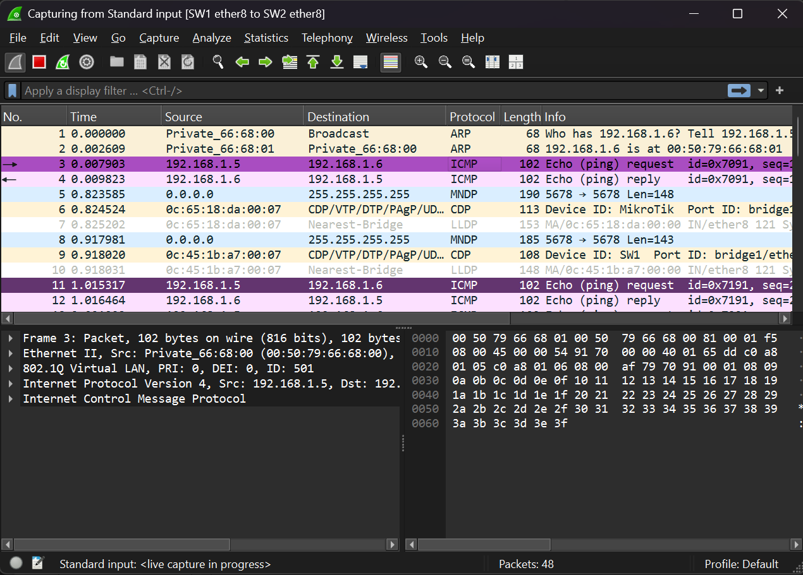
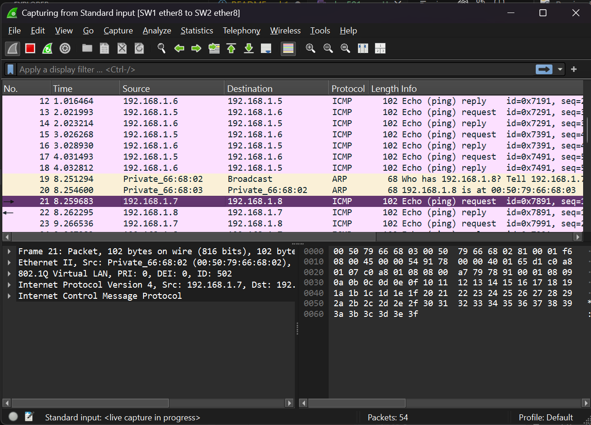
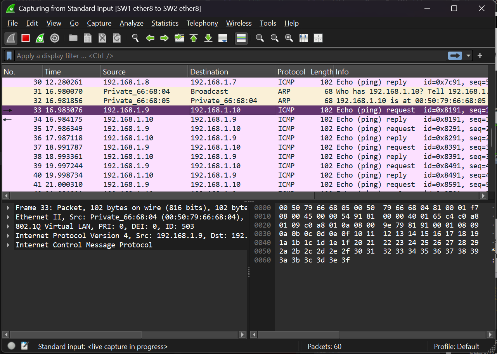

# GNS3

## Labor 1: Ping mit Switch

Hier sieht man alle Pings mit dem Wireshark Trace.

Hier ist noch der [Wireshark Export](media/ping.pcapng)

## Übung 3 – VLANs programmieren und beobachten

Hier sieht man die Übersicht mit den IPs

Hier sieht man die funktionierend und nicht funktionierenden pings

Hier sieht man noch die screenshots von wireshark

[Wireshark export](media/vlanexport.pcapng)